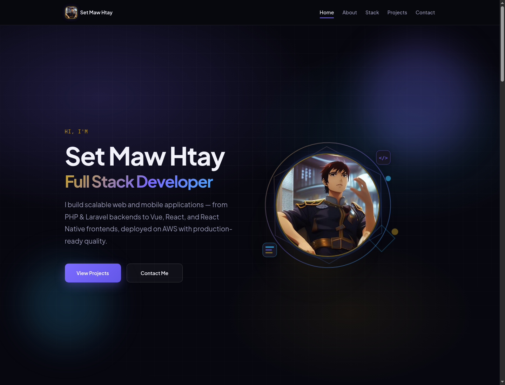

# Set Maw Htay — Portfolio

[](https://setmawhtay.github.io)
[](./package.json)
[](./LICENSE)
[](https://vuejs.org/)

Personal developer portfolio for **Set Maw Htay** — a modern single-page site showcasing full stack work, skills, and contact channels. Built with Vue 3 + Vite and deployed to GitHub Pages.

**Live:** [https://setmawhtay.github.io](https://setmawhtay.github.io)



---

## Overview

This project is a lightweight, accessible portfolio template focused on clarity and polish:

| Area | Details |
|------|---------|
| **Sections** | Hero → About → Skills (tech stack) → Projects → Contact |
| **Stack** | Vue 3 (JavaScript), Vite, plain CSS custom properties |
| **Deploy** | GitHub Actions → GitHub Pages (`https://setmawhtay.github.io`) |
| **UX** | Scroll reveal, typewriter role, mouse ambient effects, 3D accents, mobile full-screen nav |
| **A11y** | Semantic landmarks, focus states, `prefers-reduced-motion`, Escape-to-close menu |

Content (bio, projects, tech list, social links) lives in simple data files under `src/data/` so you can customize without hunting through components.

---

## Features

- Responsive layout with desktop underline nav and mobile full-screen menu
- Animated hero (typewriter role, profile frame, ambient glow)
- Skills grid with tech icons + expertise progress bars
- Animated SVG workspace illustration and 3D card ring accents
- Contact channels: Email, Telegram, GitHub
- Automated deploy on push to `main`

---

## Tech stack

- [Vue 3](https://vuejs.org/) — Composition API (`<script setup>`)
- [Vite](https://vitejs.dev/) — build & local server
- Plain CSS — design tokens in `src/assets/styles/tokens.css`
- GitHub Actions — build & deploy workflow

---

## Getting started

### Prerequisites

- Node.js 20+
- npm

### Install & run

```bash
git clone https://github.com/setmawhtay/setmawhtay.github.io.git
cd setmawhtay.github.io
npm install
npm run dev
```

Open the URL Vite prints (usually `http://localhost:5173`).

### Scripts

| Command | Description |
|---------|-------------|
| `npm run dev` | Local development server with HMR |
| `npm run build` | Production build → `dist/` |
| `npm run preview` | Preview the production build locally |

---

## Fork & customize

### 1. Fork the repository

1. Open [github.com/setmawhtay/setmawhtay.github.io](https://github.com/setmawhtay/setmawhtay.github.io)
2. Click **Fork**
3. Clone **your** fork:

```bash
git clone https://github.com/<your-username>/<your-repo>.git
cd <your-repo>
npm install
```

> **GitHub Pages tip:** For a user site at `https://<username>.github.io`, name the repo `<username>.github.io` and keep Vite `base: '/'`. For a project site, set `base: '/<repo-name>/'` in `vite.config.js`.

### 2. Update your content

| What | Where |
|------|--------|
| Name, role, bio (hero / about) | `src/components/sections/HeroSection.vue`, `AboutSection.vue` |
| Tech stack & expertise | `src/data/techStack.js` |
| Projects | `src/data/projects.js` |
| Email / Telegram / GitHub | `src/data/social.js` |
| Profile photo | `public/images/profile.png` |
| Project thumbnails | `public/images/projects/` |
| Site title & meta | `index.html` |
| Colors & spacing | `src/assets/styles/tokens.css` |

### 3. Branding checklist

- [ ] Replace profile image
- [ ] Update name and copy
- [ ] Edit projects list
- [ ] Point social links to your accounts
- [ ] Adjust accent colors in `tokens.css`
- [ ] Update `index.html` title / description
- [ ] Update copyright in `LICENSE` if you redistribute

### 4. Deploy your fork

1. Push to `main` on your fork
2. Repo **Settings → Pages → Source** → **GitHub Actions**
3. The workflow in `.github/workflows/deploy.yml` builds and publishes `dist/`

---

## Project structure

```text
├── .github/workflows/deploy.yml   # GitHub Pages deploy
├── public/                        # Static assets (favicon, images)
├── src/
│   ├── assets/styles/             # tokens, base, animations
│   ├── components/
│   │   ├── layout/                # Header
│   │   ├── sections/              # Hero, About, Skills, Projects, Contact
│   │   ├── svg/                   # Illustrations & 3D accents
│   │   └── ui/                    # Icons, scroll-to-top, ambient
│   ├── composables/               # scroll, typewriter, mouse, motion
│   ├── data/                      # Content (edit these first)
│   ├── App.vue
│   └── main.js
├── index.html
├── vite.config.js
├── LICENSE
└── package.json
```

---

## License

This project is licensed under the **MIT License** — see [LICENSE](./LICENSE).

You are free to use, fork, modify, and publish your own portfolio from this codebase. Attribution is appreciated but not required.

---

## Contributing

Issues and pull requests are welcome — especially accessibility fixes, performance tweaks, and documentation improvements.

1. Fork the repo
2. Create a branch: `git checkout -b feat/your-change`
3. Commit with a clear message (conventional commits preferred)
4. Open a pull request

---

## Support

If this portfolio template helped you:

- ⭐ **Star the repository** — it helps others find it
- Share your live fork
- Open an issue if something breaks

**Contact the author**

- Email: [setmawhtay@protonmail.com](mailto:setmawhtay@protonmail.com)
- Telegram: [@setmawhtay](https://t.me/setmawhtay)
- GitHub: [@setmawhtay](https://github.com/setmawhtay)

---

**Version:** 1.0.0 · **Author:** Set Maw Htay · **License:** MIT
